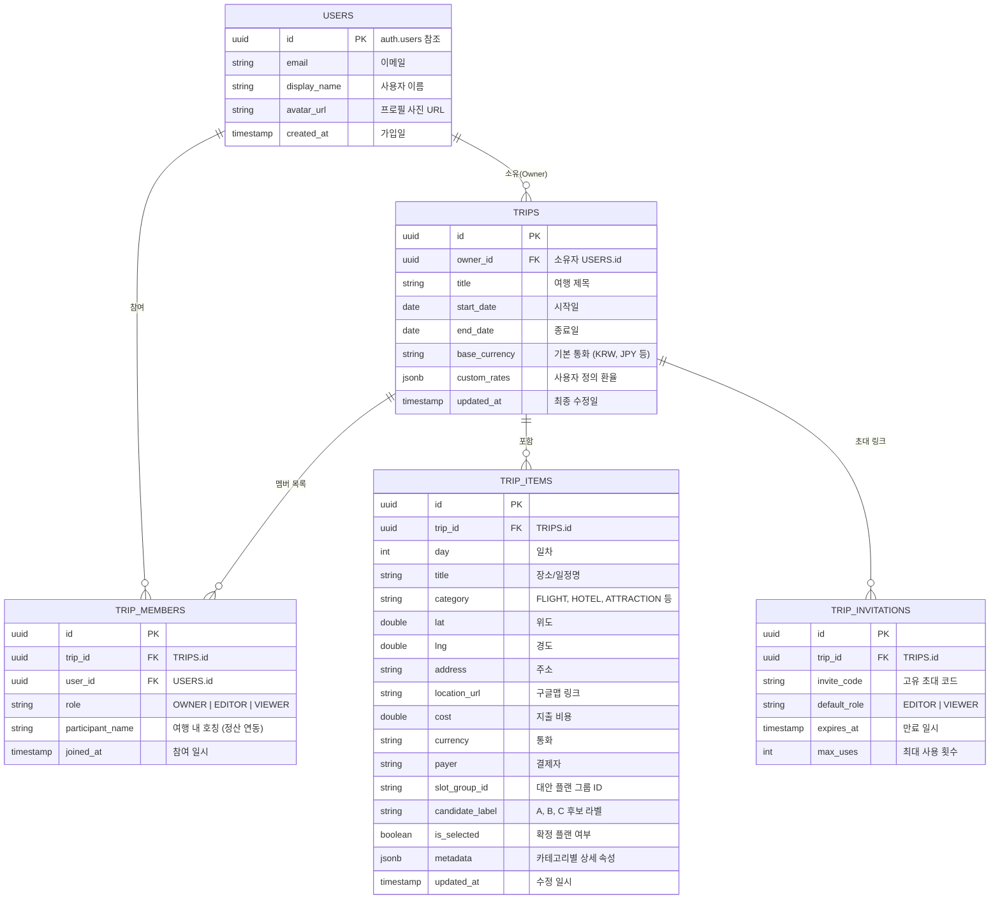

# MyTripLog 2.0.0 상용화 아키텍처 및 개발 계획서 (SSOT)

> **버전**: v2.0.0-commercial  
> **상태**: 기획 및 설계 단계 (Draft)  
> **기준 브랜치**: `feat/v2.0.0-commercial` (v1.0.0 브랜치: `release/v1.0.0` 분리 보존 완료)

---

## 1. 2.0.0 상용화 핵심 비전 & 3대 요구사항

| 번호 | 요구사항 | 비즈니스 가치 & 핵심 기능 |
| :--- | :--- | :--- |
| **REQ-1** | **인증 및 계정 관리 (Auth)** | 이메일/비밀번호 회원가입·로그인, 소셜 로그인(구글/카카오/애플), 세션 자동 갱신, 프로필 관리 |
| **REQ-2** | **계정별 클라우드 일정 격리 (Multi-Tenant)** | 사용자(UID)별 독립 데이터베이스 저장, 오프라인 퍼스트(로컬 캐시 + 온라인 자동 동기화) |
| **REQ-3** | **다중 계정 일정 공유 및 협업 (Sharing & Collab)** | 초대 코드/링크 기반 동행자 초대, 권한 체계(소유자/편집자/뷰어), 실시간 일정 변경 반영, 1/N 정산 연동 |

---

## 2. 권장 기술 스택 및 아키텍처 비교

### 옵션 A (강력 추천): **Supabase + PostgreSQL RLS + Flutter Supabase SDK**
- **선정 이유**:
  1. **관계형 데이터 무결성**: 여행(Trip) - 일정(Item) - 슬롯(SlotGroup) - 지출/정산(Settlement) 구조에 PostgreSQL RDBMS가 가장 적합.
  2. **Row Level Security (RLS)**: "자신이 생성했거나 초대받은 여행만 조회/수정 가능"을 데이터베이스 레벨에서 해킹 불가능하게 원천 차단.
  3. **실시간 협업 (Realtime WebSocket)**: 동행자가 일정을 변경하면 내 화면에서도 새로고침 없이 즉시 반응.
  4. **인증 통합 (GoTrue)**: 이메일 가입, 비밀번호 재설정, 구글/애플/카카오 소셜 로그인을 단일 인터페이스로 제공.
  5. **무료 티어 및 오픈소스**: 월간 활성 사용자(MAU) 50,000명까지 완전 무료, 필요 시 자체 Docker 호스팅 가능.

### 옵션 B: **Firebase (Auth + Cloud Firestore)**
- NoSQL 특성상 1/N 정산, 다중 슬롯 후보 등 복합 트랜잭션 구현 시 인덱스 및 쿼리 제약 존재.

### 옵션 C: **자체 백엔드 API (Node.js NestJS / Go / FastAPI + PostgreSQL)**
- 완전한 통제권이 있으나 서버 호스팅 비용 및 API 유지보수 공수 증가.

---

## 3. 데이터베이스 스키마 설계 (ERD 개요)

---

## 4. 단계별 마일스톤 계획 (Milestones)

### Phase 1: 인증 및 보안 기본기 (Auth & Security Foundation)
- [ ] Supabase 프로젝트 연동 및 환경 변수(`.env`) 세팅
- [ ] 로그인, 이메일 회원가입, 비밀번호 찾기 UI/UX 구현 (KRDS 및 모바일 표준 준수)
- [ ] 소셜 로그인 연동 (Google 우선 연동)
- [ ] 세션 영속화 및 `AuthProvider` 상태 관리 구축

### Phase 2: 클라우드 DB 연동 및 오프라인 퍼스트 (Cloud Sync & Multi-Tenant)
- [ ] PostgreSQL 테이블 생성 및 RLS 보안 정책 적용
- [ ] 기존 로컬(SharedPreferences) 데이터 -> 로그인 계정으로 원터치 마이그레이션(가져오기) 기능
- [ ] 로컬 캐시 + 원격 클라우드 양방향 동기화(SyncEngine) 구축

### Phase 3: 다중 계정 공유 및 실시간 협업 (Sharing & Realtime)
- [ ] 여행 참여자 관리 바텀 시트 구현 (소유자, 편집자, 뷰어)
- [ ] 6자리 고유 초대 코드 및 딥링크 공유 기능
- [ ] 초대 코드 입력 시 여행 즉시 합류 및 권한 부여
- [ ] 실시간 변경(Realtime) 구독을 통한 실시간 일정/정산 동기화

### Phase 4: 상용화 출시 준비 및 배포 (Commercial Launch)
- [ ] 앱 아이콘, 스플래시 화면, 정식 패키지명(`com.mytriplog.app`) 정비
- [ ] 약관 동의(이용약관, 개인정보처리방침) 화면 구현
- [ ] 성능 최적화 및 릴리스 키스토어 서명
